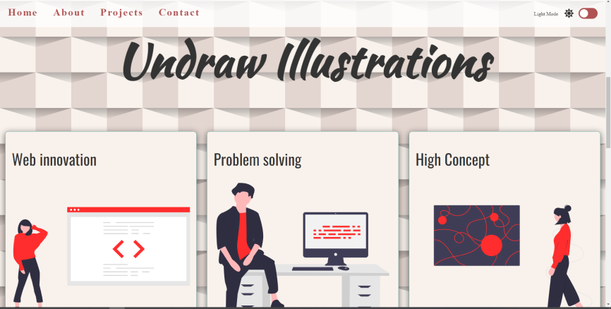
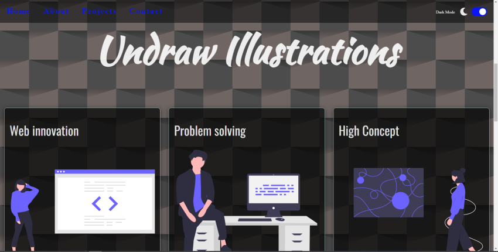

# Light & Dark mode switching style page

## Login

To get access to the app's content you need to run it into your browser.

## Content

After loading page, user is by default switched on light mode styled page.

 User can then click on switcher which is positioned on top right corner  
 on the navigation bar. 

 User can switch back to light mode. If dark mode is last mode that user has been using 
 before leaving a page, it is considered to be choosen one. 

 It is remembered in localStorage and another time visiting a page, same mode will be loaded first.

## Used content links
* Fonts: https://fonts.google.com/
* Icons: https://fontawesome.com/icons?d=gallery&q=close&m=free
* Undraw illustrations: https://undraw.co/illustrations

# 👉 Built with
* HTML5
* CSS3
* JS

# 💻 Development
1. run index.html on your browser
2. git clone https://github.com/valerijadrinek/dark-light-mode-switching-page.git
3. github pages https://valerijadrinek.github.io/dark-light-mode-switching-page/
